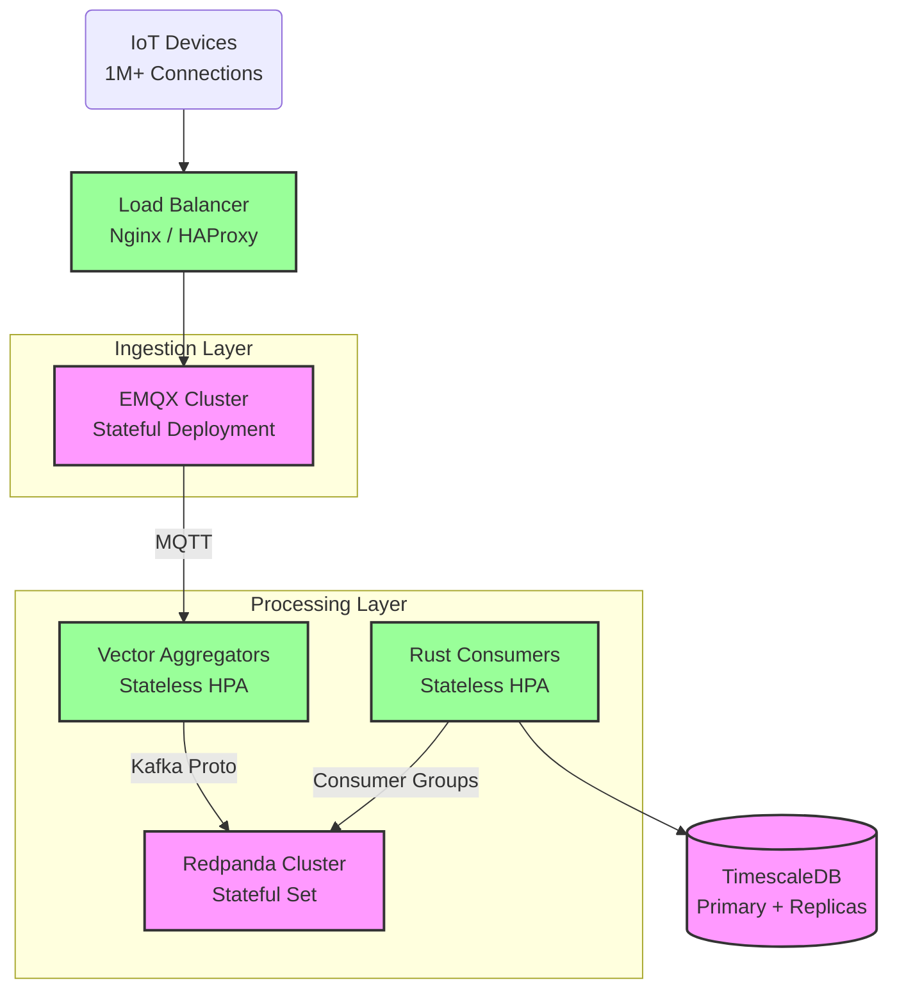

# Production Scaling Guide for IoT MQTT Backend

This guide details the architectural strategies required to scale the system for high-volume production loads (1M+ devices, 100k+ msg/s).

## 1. High-Level Architecture
The system is designed as a **Stream Processing Pipeline**. Bottlenecks move downstream as you scale.

---

## 2. Component Scaling Strategies

### A. EMQX (MQTT Broker)
*   **Role:** Maintains persistent TCP connections with devices.
*   **Scaling Bottleneck:** Memory (RAM per connection) and CPU (SSL Handshakes).
*   **Strategy:** **Horizontal Clustering**.
    *   **Action:** Add new EMQX nodes to the `Core` or `Replicant` node pool.
    *   **Load Balancing:** Requires an external Load Balancer (AWS NLB, Nginx) to distribute *new* connections via `Least Connections` algorithm.
    *   **Constraint:** Existing connections are "sticky". To rebalance a cluster, you must force a percentage of devices to reconnect.

### B. Vector (Data Pipeline)
*   **Role:** Buffer, transform, and batch metrics before Kafka.
*   **Scaling Bottleneck:** CPU (JSON parsing) and Network I/O.
*   **Strategy:** **Horizontal Pod Autoscaling (HPA)**.
    *   **Configuration:** Target 60% CPU utilization.
    *   **Behavior:** As log volume increases, Kubernetes spawns more Vector pods.
    *   **No State:** Pods can be killed anytime without data loss (assuming source replays or short buffers).

### C. Redpanda (Streaming Platform)
*   **Role:** Durable intermediate buffer. Decouples ingestion from processing.
*   **Scaling Bottleneck:** Disk I/O (Write throughput) and Network Bandwidth.
*   **Strategy:** **Horizontal Scaling with Partition Rebalancing**.
    *   **Action:** Add Broker nodes via Helm/Operator.
    *   **Critical Step:** Run `rpk cluster partitions rebalance`. This moves partition leadership to new nodes to utilize their disk/CPU. Without rebalancing, new nodes sit idle.
    *   **Partitions:** Ensure topic partition count >= number of consumer pods to allow parallel processing.

### D. Rust Backend (Consumer)
*   **Role:** Business logic, DB insertion.
*   **Scaling Bottleneck:** CPU (Processing logic) and DB Write Latency.
*   **Strategy:** **Horizontal Pod Autoscaling (KEDA / HPA)**.
    *   **Metric:** Scale based on **Consumer Lag** (not just CPU). If lag > 1000 messages, add pods.
    *   **Constraint:** Max replicas cannot exceed Redpanda partition count (extra consumers will sit idle).

### E. TimescaleDB (Storage)
*   **Role:** High-cardinality time-series storage.
*   **Scaling Bottleneck:** Disk Write IOPS and Query CPU.
*   **Strategy 1 (Writes):** **Vertical Scaling**.
    *   Upgrade Node (e.g., 16 vCPU -> 32 vCPU).
    *   Optimize Chunk Size (ensure active chunk fits in RAM).
*   **Strategy 2 (Writes):** **Multi-Node / Sharding** (Advanced).
    *   Distribute hypertables across multiple physical nodes.
*   **Strategy 3 (Reads):** **Read Replicas**.
    *   Deploy streaming replicas. Point Grafana/API read queries to the replica pool.

---

## 3. Production Checklist

| Component | metric to Watch | Action Threshold | Scaling Action |
| :--- | :--- | :--- | :--- |
| **EMQX** | Active Connections | > 100k / node | Add Replicant Node |
| **Vector** | CPU Usage | > 70% | HPA Trigger (Auto) |
| **Redpanda** | Disk Latency | > 10ms (p99) | Add Broker + Rebalance |
| **Backend** | Consumer Lag | > 5s latency | HPA Trigger (Auto) |
| **DB** | IOPS Utilization | > 80% | Upgrade Disk / Node |
