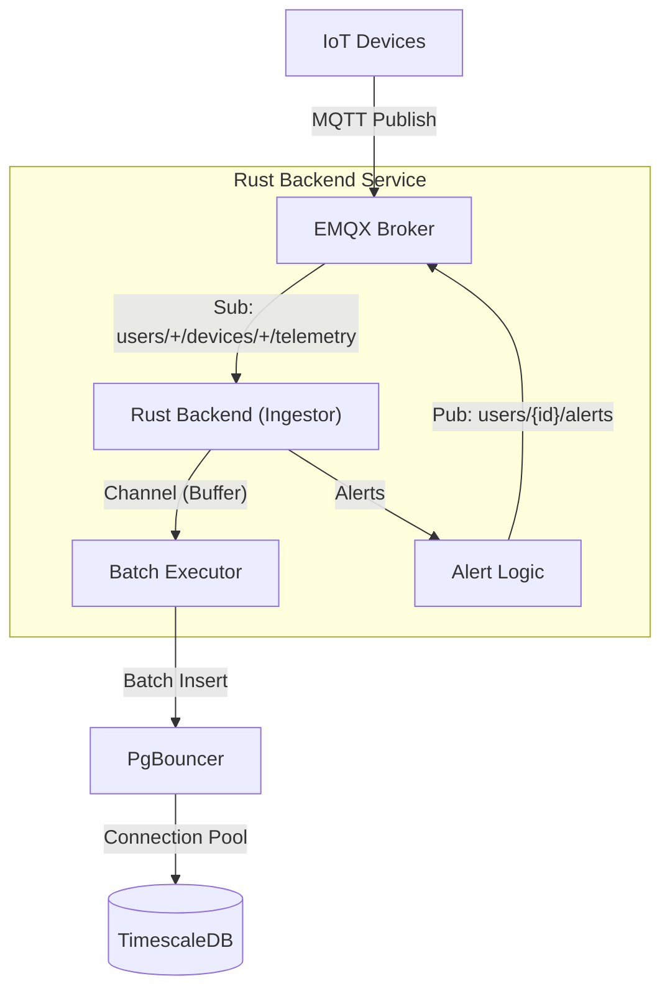

# IoT MQTT Backend POC 🚀

A high-performance, scalable, and reliable MQTT backend written in **Rust**.
Designed to ingest high-frequency telemetry data from thousands of IoT devices without data loss.

## 🏗️ Architecture

The system follows a **Modular Actor-like Architecture** to separate concerns and maximize throughput.



### Key Components
1.  **Ingestor (Main Thread)**:
    *   Handles MQTT Network IO (Rumqttc).
    *   Parses JSON payloads.
    *   Checks immediate alerts (High Temperature).
    *   **Monitors Lag**: Logs warnings if processing old data (Deep Queue).
    *   **Backpressure**: Pauses ingest if the internal buffer is full.

2.  **Batch Executor (Worker Thread)**:
    *   Reads from internal channel (Capacity 10,000).
    *   Buffers messages (up to 1,000 or 100ms).
    *   Performs **Bulk Inserts** into TimescaleDB.
    *   **Serial Fallback**: If a batch fails, retries one-by-one to prevent data loss.
    *   **Reliable Ack**: Only Acks MQTT message *after* DB confirmation.

3.  **Infrastructure**:
    *   **EMQX 5.0**: Enterprise-grade MQTT Broker. Configured for **1 Million Message Queue** per session.
    *   **TimescaleDB**: Time-series optimized PostgreSQL.
    *   **PgBouncer**: Connection pooling to support concurrent heavy writes.

---

## 📊 Schema & Data Model

We utilize **TimescaleDB** (PostgreSQL extension) for efficient time-series storage.

### `raw_telemetry` Table
| Column | Type | Description |
| :--- | :--- | :--- |
| **time** | `TIMESTAMPTZ` | **PK (Partition Key)**. Event timestamp. |
| **user_id** | `TEXT` | **PK**. Extracted from Topic `users/{id}/...`. |
| **device_id** | `TEXT` | **PK**. Unique ID for device *within* a user. |
| **sequence_id** | `BIGINT` | **PK**. Deduplication ID from device. |
| temperature | `DOUBLE` | Telemetry value. |
| battery | `INT` | Telemetry value. |
| extra_data | `JSONB` | Flexible payload for undefined fields. |

> **Primary Key**: `(time, user_id, device_id, sequence_id)`
> This Composite Key ensures that even if two users have a "device_001" sending "seq_1" at the same time, they are stored as distinct records.

---

## 🛡️ Reliability & Zero Data Loss
This system is verified to achieve **Zero Data Loss** via:

1.  **Persistent Sessions**: `clean_session=false`. If the backend crashes, the Broker queues messages.
2.  **Extended Queue Limits**: Custom `emqx.conf` allows buffering 1,000,000 messages (default is 1,000).
3.  **Graceful Shutdown**: On `Ctrl+C`, the system stops accepting new IO but keeps the network alive until all buffered batches are flushed and Acked.

---

## 🚀 Scalability Findings
*   **Throughput**: Limited primarily by Database Write IOPS.
*   **Concurrency**: Uses Async Rust (Tokio) to handle thousands of messages per second on a single thread.
*   **Bottlenecks**:
    *   **Single Broker Node**: Currently a Single Point of Failure (SPOF).
    *   **Vertical Scaling**: Current setup runs on one instance. To scale horizontally, switch to **Shared Subscriptions** (`$share/group/...`).

---

## 🛠️ Setup & Running

### Prerequisites
*   Docker & Docker Compose
*   Rust Toolchain (`cargo`)

### 1. Start Infrastructure
```bash
docker-compose up -d
```
*   Starts EMQX, TimescaleDB, PgBouncer.
*   **Note**: `emqx.conf` is mounted to override default limits.

### 2. Run Backend
```bash
cargo run --bin poc-mqtt-backend
```

### 3. Run Load Tester
```bash
cargo run --bin load-tester -- --users 30 --devices-per-user 3 --rate 200
```

---

## 🚨 Production Risks (Known Issues)
1.  **Single Point of Failure**: We run a single EMQX node. Production should use a 3-node Cluster.
2.  **Memory Pressure**: If the backend is down for days, the Broker execution queue (1M messages) may consume significant RAM.
3.  **Network Burst**: On reconnect, the backend receives a massive burst. We handle this via Backpressure logging, but extreme bursts could saturate the NIC.

