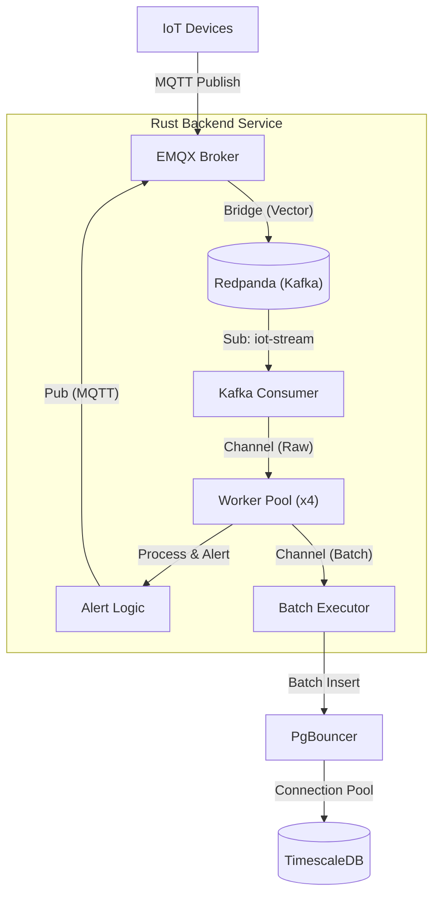

# IoT MQTT Backend POC 🚀

A high-performance, scalable, and reliable MQTT backend written in **Rust**.
Designed to ingest high-frequency telemetry data from thousands of IoT devices and process it via a durable **Kafka (Redpanda)** stream.

## 🏗️ Architecture

The system decouples **Ingestion** (MQTT) from **Processing** (Rust) using Redpanda as a durable buffer.



### Key Components
1.  **Redpanda (Kafka)**:
    *   Acts as the persistent buffer/WAL (Write Ahead Log).
    *   **Topic**: `iot-stream`.
    *   Ensures that even if the backend is down, messages are safely stored on disk.
    *   Decouples the high-concurrency "Fan-In" of MQTT from the linear processing of the backend.

2.  **Vector (Bridge)**:
    *   Sidecar container running `timberio/vector`.
    *   Automatically subscribes to MQTT `users/+/devices/+/telemetry`.
    *   Forwards messages to Redpanda `iot-stream`.
    *   Handles Format Transformation (JSON Parser).

3.  **Rust Backend**:
    *   **Kafka Consumer**: Fetches messages from Redpanda and pushes them to a local channel. Zero processing logic here to avoid blocking heartbeat.
    *   **Worker Pool**: A pool of concurrent workers (default: 4) that parse, validate, and process business logic (Alerts).
    *   **Batch Executor**: Buffers processed telemetry up to 1,000 messages or 100ms before Bulk Insert.
    *   **Alerting**: Checks thresholds and publishes alerts back to EMQX.

4.  **Infrastructure**:
    *   **EMQX 5.3**: Open Source MQTT Broker.
    *   **TimescaleDB**: Time-series optimized PostgreSQL.
    *   **Redpanda Console**: UI for monitoring topics (Port `8080`).

---

## 📊 Schema & Data Model

### `raw_telemetry` Table (TimescaleDB Hypertable)

This table stores all incoming high-frequency data. It is partitioned by `time` for efficient time-series queries.

```sql
CREATE TABLE raw_telemetry (
    time        TIMESTAMPTZ       NOT NULL, -- Partition Key
    user_id     TEXT              NOT NULL, 
    device_id   TEXT              NOT NULL,
    sequence_id BIGINT            NOT NULL,
    temperature DOUBLE PRECISION  NULL,
    battery     INTEGER           NULL,
    extra_data  JSONB             NULL,     -- Stores any extra fields
    
    PRIMARY KEY (time, user_id, device_id, sequence_id)
);
```

---

## 🛡️ Reliability & Zero Data Loss
1.  **Durable Buffer**: Redpanda stores all incoming telemetry on disk before processing.
2.  **Backpressure**: The Rust backend consumes at its own pace (Pull Model) rather than being overwhelmed by Pushes.
3.  **Graceful Shutdown**: Finish processing current batch before exit.

---

## 🚀 Scalability Findings
*   **Decoupling**: By moving ingestion to Redpanda, the MQTT broker can scale independently of the Backend.
*   **Replay**: We can re-process historical data by resetting the Kafka consumer group offset.

---

## 🛠️ Setup & Running

### Prerequisites
*   Docker & Docker Compose
*   Rust Toolchain (`cargo`)
*   PostgreSQL Client (`psql`) - Optional but recommended

### 1. Start Infrastructure
Start EMQX, Redpanda, TimescaleDB, and Vector:
```bash
docker-compose up -d
```
*   **Wait** for `redpanda-init` to finish creating the topic (check `docker-compose logs -f redpanda-init`).
*   **Check Redpanda Console**: http://localhost:8080
*   **Check EMQX Dashboard**: http://localhost:18083 (admin/public)

### 2. Initialize Database & Security
The `utils_db` container runs `init.sql`, creating tables and default users.
However, for security, you should verify the `backend_service` user exists.

**Add Backend User (if not exists):**
```bash
docker exec -it timescaledb psql -U postgres -d iot_db -c "INSERT INTO mqtt_users (username, password_hash, is_superuser) VALUES ('backend_service', 'secure_password', TRUE) ON CONFLICT (username) DO NOTHING;"
```

**Add Device User (for testing):**
```bash
docker exec -it timescaledb psql -U postgres -d iot_db -c "INSERT INTO mqtt_users (username, password_hash, is_superuser) VALUES ('device_001', 'device_password', FALSE) ON CONFLICT (username) DO NOTHING;"
```

### 3. Configure Backend
Ensure your `.env` file has the correct credentials (matches DB insert above):
```bash
MQTT_HOST=localhost
MQTT_PORT=1883
MQTT_USERNAME=backend_service
MQTT_PASSWORD=secure_password
```

### 4. Run Backend
```bash
cargo run --bin poc-mqtt-backend
```
You should see: `MQTT Connected! Resubscribing to Configs...`

### 5. Run Load Tester
The load tester simulates devices. It also needs credentials.
*Note: The load tester currently uses a fixed user/pass or needs to be updated to support auth. For now, ensure anonymous auth is disabled only if load tester supports creds.*

```bash
cargo run --bin load-tester -- --users 30 --devices-per-user 3 --rate 200
```


---


### 6. Configure Open Source Bridge (Vector) (Data Integration)
The system uses **Vector** (`timberio/vector`) as a sidecar to bridge MQTT messages to Redpanda (Kafka), fulfilling the Open Source requirement.

**Configuration:**
The bridge logic is defined in `vector.toml`.
*   **Source**: MQTT (EMQX).
*   **Transform**: Remaps JSON payload.
*   **Sink**: Kafka (Redpanda).

**Authentication:**
Vector must authenticate with EMQX to subscribe to telemetry topics. The credentials are configured in `vector.toml`:
```toml
[sources.emqx_source.auth]
strategy = "basic"
user = "backend_service"
password = "secure_password"
```

**Verification:**
Check Vector logs to ensure successful connection:
```bash
docker logs vector
```

---

## 🔒 Production Security

For a production deployment, you **MUST** configure MQTT Authentication and ACLs to secure the system.

*   **Authentication**: Disable anonymous access.
*   **Authorization (ACLs)**: Restrict devices to their own `telemetry` topics.
*   **TLS**: Encrypt data in transit.

### EMQX Configuration (Postgres Auth)
The project includes a pre-configured `emqx-config/emqx.conf` that connects to TimescaleDB for authentication.

1.  **Mount Config**: Ensure `docker-compose.yml` mounts `./emqx-config/emqx.conf:/opt/emqx/etc/emqx.conf`.
2.  **Database Setup**: The `init.sql` script automatically creates the necessary `mqtt_users` and `mqtt_acl` tables.
3.  **Seed Users**: You must insert users into the `mqtt_users` table for the Backend and Devices to connect.

👉 **See [SECURITY.md](Security-Guidelines.md) for the full security hardening guide.**

---


## 🔧 How to Adapt for Your Own Data Schema

To use this project as a base for a different data model (e.g., Logistics, Finance, Healthcare), follow these 3 steps:

### 1. Modify Database Schema (`init.sql`)
Update the SQL table definition to match your new data fields.
```sql
-- Example: Changing from "Telemetry" to "LogisticsPackage"
CREATE TABLE raw_packages (
    ...
    package_id TEXT NOT NULL,
    location   GEOMETRY(POINT, 4326),
    status     TEXT,
    ...
);
```

### 2. Update Domain Model (`src/domain/mod.rs`)
Modify the Rust struct to align with your new data.
```rust
#[derive(Debug, Clone, Deserialize, Serialize)]
pub struct PackageData {
    // ... matching fields ...
    pub package_id: String,
    pub location: String, 
    // ...
}
```

### 3. Update Persistence Layer (`src/adapters/timescale.rs`)
Rewrite the SQL `INSERT` statement in the `store_telemetry` and `store_telemetry_batch` functions to target your new table and columns.
```rust

let query = r#"
    INSERT INTO raw_packages (time, package_id, location, status)
    VALUES ($1, $2, $3, $4)
"#;
```

---

### Example 2: Financial Market Data

If you are building a **Stock/Crypto Ticker** processing engine:

1.  **SQL Schema** (`init.sql`):
    ```sql
    CREATE TABLE raw_ticks (
        time      TIMESTAMPTZ        NOT NULL,
        symbol    TEXT               NOT NULL, -- e.g. "BTC-USD"
        price     DOUBLE PRECISION   NOT NULL,
        volume    DOUBLE PRECISION   NOT NULL,
        PRIMARY KEY (time, symbol)
    );
    ```

2.  **Rust Struct** (`src/domain/mod.rs`):
    ```rust
    #[derive(Debug, Clone, Deserialize, Serialize)]
    pub struct MarketTick {
        #[serde(with = "time::serde::iso8601")]
        pub time: OffsetDateTime,
        pub symbol: String,
        pub price: f64,
        pub volume: f64,
    }
    ```

3.  **Persistence** (`src/adapters/timescale.rs`):
    ```rust
    let query = r#"
        INSERT INTO raw_ticks (time, symbol, price, volume)
        VALUES ($1, $2, $3, $4)
    "#;
    ```

### 4. Update Alert Logic (`src/service/processor.rs`)

Modify the `process_ingest_logic` function to check for your specific business conditions.

**For Logistics (Delayed Package):**
```rust
if package.status == "DELAYED" {
    let alert = Alert::new(
        package.package_id.clone(),
        "DeliveryDelay".to_string(),
        format!("Package {} is delayed at {}", package.package_id, package.location),
        None,
    );
    self.storage.store_alert(&alert).await?; // Store in DB
    self.broker.publish(...).await?;         // Push to MQTT
}
```

**For Finance (Price Drop):**
```rust
let config = self.config_manager.get_config(&tick.symbol);
if tick.price < config.price_floor {
    let alert = Alert::new(
        tick.symbol.clone(),
        "PriceCrash".to_string(),
        format!("{} dropped below ${}", tick.symbol, config.price_floor),
        Some(tick.price),
    );
    // ... publish alert ...
}
```

---

## 🔔 Dynamic Alert Configuration

The system supports a dynamic rules engine. You can define custom alert thresholds for any telemetry field (including nested JSON fields) without changing code.

### 1. Rule Structure (JSON)
Each rule consists of:
*   `key`: The JSON field name to check (e.g., "temperature", "battery", "pressure").
*   `operator`: Comparison operator (`>`, `<`, `>=`, `<=`, `==`).
*   `threshold`: The numeric value to compare against.
*   `message`: Custom alert message.

### 2. Adding Rules (SQL)
To add rules for a specific user, update the `rules` JSONB column in the `user_configs` table.

**Example:**
Create an alert if `battery < 20.0` OR if a custom field `pressure > 105.5`.

```sql
VALUES (
    'user_123', 
    '[
        {
            "key": "temperature",
            "operator": ">",
            "threshold": 80.0,
            "message": "High Temperature Alert"
        },

        {
            "key": "battery",
            "operator": "<",
            "threshold": 20.0,
            "message": "Critical Battery Level!"
        },
        {
            "key": "pressure",
            "operator": ">",
            "threshold": 105.5,
            "message": "Overpressure detected"
        }
    ]'::jsonb
)
ON CONFLICT (user_id) DO UPDATE 
SET rules = EXCLUDED.rules;
```

### 3. Adding Rules (MQTT)
You can also push new rules dynamically via MQTT.

**Topic:** `users/{user_id}/config`
**Payload:**
```json
{
  "rules": [
    {
      "key": "temperature",
      "operator": ">",
      "threshold": 80.0,
      "message": "High Temperature Alert"
    },

    {
      "key": "vibration",
      "operator": ">",
      "threshold": 5.0,
      "message": "High Vibration Detected"
    }
  ]
}
```
