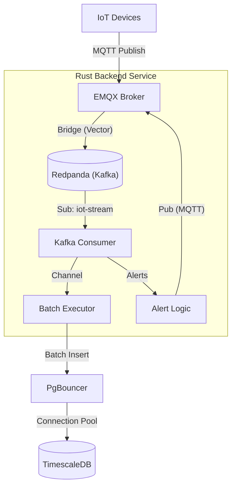

# IoT MQTT Backend POC 🚀

A high-performance, scalable, and reliable MQTT backend written in **Rust**.
Designed to ingest high-frequency telemetry data from thousands of IoT devices and process it via a durable **Kafka (Redpanda)** stream.

## 🏗️ Architecture

The system decouples **Ingestion** (MQTT) from **Processing** (Rust) using Redpanda as a durable buffer.



### Key Components
1.  **Redpanda (Kafka)**:
    *   Acts as the persistent buffer/WAL (Write Ahead Log).
    *   **Topic**: `iot-stream`.
    *   Ensures that even if the backend is down, messages are safely stored on disk.
    *   Decouples the high-concurrency "Fan-In" of MQTT from the linear processing of the backend.

2.  **Vector (Bridge)**:
    *   Sidecar container running `timberio/vector`.
    *   Automatically subscribes to MQTT `users/+/devices/+/telemetry`.
    *   Forwards messages to Redpanda `iot-stream`.
    *   Handles Format Transformation (JSON Parser).

3.  **Rust Backend**:
    *   **Consumer**: Reads from Redpanda using `rdkafka`.
    *   **Batch Executor**: Buffers up to 1,000 messages or 100ms before Bulk Insert.
    *   **Alerting**: Checks thresholds and publishes alerts back to EMQX.

4.  **Infrastructure**:
    *   **EMQX 5.0**: Enterprise-grade MQTT Broker.
    *   **TimescaleDB**: Time-series optimized PostgreSQL.
    *   **Redpanda Console**: UI for monitoring topics (Port `8080`).

---

## 📊 Schema & Data Model

(Same as previous, utilizing TimescaleDB `raw_telemetry` table).

---

## 🛡️ Reliability & Zero Data Loss
1.  **Durable Buffer**: Redpanda stores all incoming telemetry on disk before processing.
2.  **Backpressure**: The Rust backend consumes at its own pace (Pull Model) rather than being overwhelmed by Pushes.
3.  **Graceful Shutdown**: Finish processing current batch before exit.

---

## 🚀 Scalability Findings
*   **Decoupling**: By moving ingestion to Redpanda, the MQTT broker can scale independently of the Backend.
*   **Replay**: We can re-process historical data by resetting the Kafka consumer group offset.

---

## 🛠️ Setup & Running

### Prerequisites
*   Docker & Docker Compose
*   Rust Toolchain (`cargo`)

### 1. Start Infrastructure
```bash
docker-compose up -d
```
*   **Wait** for `redpanda-init` to finish creating the topic (check `docker-compose logs redpanda-init`).
*   **Check UI**: http://localhost:8080 (Redpanda Console).

### 2. Run Backend
```bash
cargo run --bin poc-mqtt-backend
```

### 3. Run Load Tester
```bash
cargo run --bin load-tester -- --users 30 --devices-per-user 3 --rate 200
```

